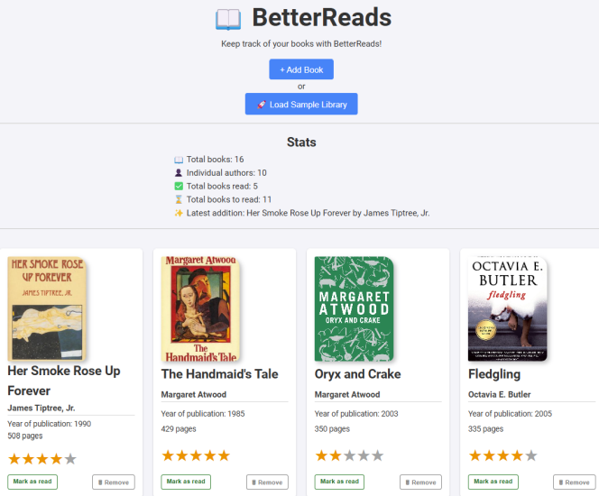

# BetterReads

A digital book tracker built with HTML, CSS, and JavaScript.

### 🔗 Live Demo

https://estellel-github.github.io/better-reads/

---

## Features

- Add books with details like title, author, year of publication, number of pages, a cover image, and a rating.
- See library stats: total books, unique authors, read/unread counts, latest addition.
- Re-load sample library to test the interface if library is empty.
- Data persistence with LocalStorage.

---

## Tools Used

- **Development**: Visual Studio Code
- **Version Control**: Git and GitHub

---

## External Resources

- Google Fonts for typography
- Wikimedia for book covers

---

## Learning Outcomes

- Improved my proficiency in DOM manipulation and event handling in JavaScript.
- More practice with implementing responsive design using CSS Grid.
- First successful attempt at implementing persistent storage with LocalStorage.

---

## How to Use

1. Clone the repository.
2. Open `index.html` in your browser.
3. Click on the **+ Add Book** button to add books manually.
4. Use the **Load Sample Library** button to explore the sample library.
5. Manage your library by marking books as read/unread, or removing them.
